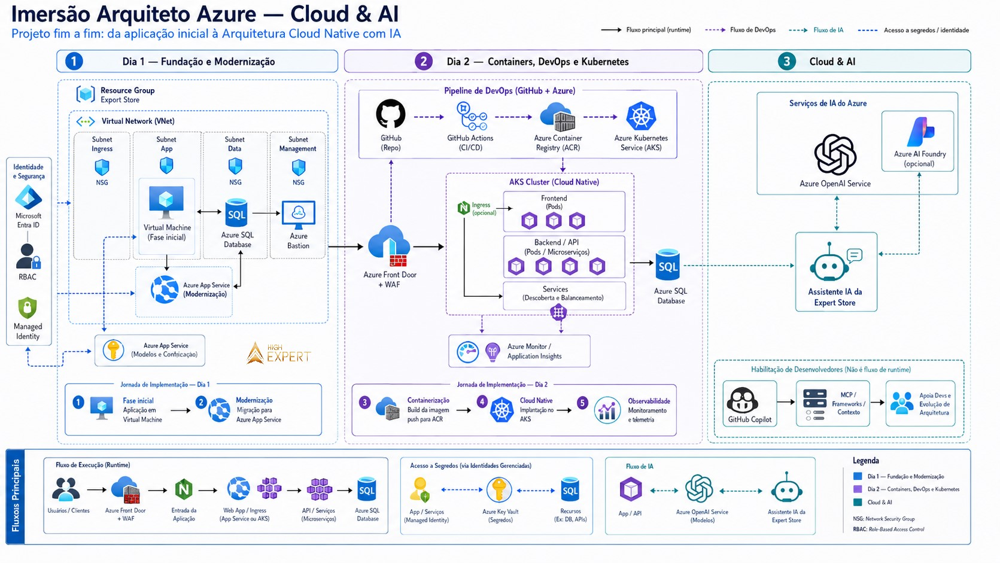

# 🛒 AzureShop — Arquitetura Cloud Native, DevSecOps & AI (Projeto Finalizado)

---

## 🚀 Visão Geral do Projeto Finalizado

Este repositório contém a aplicação **AzureShop** completamente modernizada. O projeto demonstra a transição de uma arquitetura tradicional (IaaS) para um modelo **Cloud Native, resiliente, seguro (Zero Trust) e com Inteligência Artificial Generativa** na nuvem Microsoft Azure[cite: 1, 2].

### 🗺️ Topologia de Rede & Diagrama de Arquitetura

---

### 🛠️ O que foi Desenvolvido (Tecnologias & Arquitetura)

* **Borda & Proteção Web:** Tráfego filtrado pelo **Azure Front Door** com **WAF (Web Application Firewall)** para mitigar ameaças da web e balancear o acesso global[cite: 1, 2].
* **Orquestração em Kubernetes (AKS):** Aplicação Node.js empacotada em Docker e implantada no **Azure Kubernetes Service (`aks-imersao-elfarias`)** no namespace `azure-shop`, operando com réplicas autoescaláveis de Frontend e Backend[cite: 1, 2].
* **Banco de Dados Privado (Zero Trust):** **Azure SQL Database (`sqlsrvazureshop`)** com acesso público 100% desativado (`Disabled`)[cite: 1, 2]. Conexão realizada de forma restrita via **Private Endpoint**, **Private DNS Zone** e **VNet Peering** liberado na porta TCP 1433 por regras de NSG[cite: 1, 2].
* **Segurança Passwordless:** Autenticação por **Managed Identity** integrada ao **Azure Key Vault**, garantindo que nenhuma senha permaneça gravada no código[cite: 1, 2].
* **Inteligência Artificial Generativa:** Conexão da aplicação ao **Azure OpenAI Service** (gerenciado via **Azure AI Foundry**), capacitando o **Assistente IA da Expert Store** a consultar o estoque no Azure SQL e interagir com os clientes[cite: 1, 2].

---

### 🛡️ Esteira DevSecOps (CI/CD Automatizado)

A publicação ocorre via **GitHub Actions** (`.github/workflows/deploy.yml`) com 5 etapas automatizadas de segurança e testes[cite: 1]:

1. **OIDC Auth:** Autenticação no Azure sem senhas salvas via OpenID Connect (`app-ghactions-azureshop`)[cite: 1].
2. **GitLeaks:** Varredura no código para impedir o envio de chaves ou segredos expostos[cite: 1].
3. **Checkov:** Auditoria estática dos arquivos de Infraestrutura como Código em Terraform[cite: 1].
4. **npm test:** Execução automatizada de 13 testes unitários para validar rotas e APIs (`/api/health`)[cite: 1, 2].
5. **Trivy Scan:** Varredura de vulnerabilidades (CVEs) na imagem Docker[cite: 1].
6. **Rolling Update:** Compilação no **Azure Container Registry (ACR)** com a tag imutável do commit (`${{ github.sha }}`) e atualização gradual no AKS sem tempo de inatividade[cite: 1].

---

### 🔄 Evolução: Aplicação vs. Banco de Dados

| Fase | Aplicação (AzureShop) | Banco de Dados | Conectividade & Segurança |
| :--- | :--- | :--- | :--- |
| **1. Início (IaaS)** | Instalada em VM Ubuntu (`vm-imersao`)[cite: 1, 2]. | Arquivo local SQLite (`loja.db`)[cite: 1, 2]. | Aplicação e dados no mesmo servidor (alto risco)[cite: 2]. |
| **2. Modernização (PaaS)** | Executada no Azure App Service[cite: 1, 2]. | Azure SQL Database (`sqlsrvazureshop`)[cite: 1, 2]. | Tráfego privado por Private Endpoint e VNet Integration[cite: 1, 2]. |
| **3. Cloud Native (K8s)** | Contêineres Docker orquestrados no AKS[cite: 1, 2]. | Azure SQL Database (`sqlsrvazureshop`)[cite: 1, 2]. | VNet Peering bidirecional e NSG liberado em TCP 1433[cite: 1, 2]. |
| **4. Inteligente (AI)** | Integrada ao Azure OpenAI (Assistente Virtual)[cite: 1, 2]. | Azure SQL Database (`sqlsrvazureshop`)[cite: 1, 2]. | Managed Identity para consulta de credenciais no Key Vault[cite: 1, 2]. |

---

 

# AzureShop — Imersão Arquiteto Azure Cloud & AI

Material da aplicação AzureShop para os laboratórios da Imersão Arquiteto Azure[cite: 4].

## Comece pelo workshop

Leia o [guia completo do workshop](docs/WORKSHOP.md)[cite: 4]. Ele reúne os pré-requisitos, a sequência dos laboratórios e as orientações de segurança e custo[cite: 4].

## Obter o projeto

- **[Download ZIP (não exige Git)](https://github.com/highexpert-tecnologia/azureshop/archive/refs/heads/main.zip):** baixe o projeto sem instalar Git[cite: 4].
- **Clone com Git:** `git clone https://github.com/highexpert-tecnologia/azureshop.git`[cite: 4]

O caminho padrão do workshop usa o [Portal do Azure](https://portal.azure.com/) e o [Azure Cloud Shell](https://learn.microsoft.com/azure/cloud-shell/overview), reduzindo instalações locais[cite: 4]. Você não precisa executar a aplicação localmente para acompanhar o Dia 1[cite: 4].

## Conteúdo do repositório

- `docs/`: workshop, arquitetura e diagramas sanitizados[cite: 4].
- `public/` e `src/`: frontend e API da AzureShop[cite: 4].
- `infra/terraform/`: infraestrutura didática em Terraform e `terraform.tfvars.example`[cite: 4].
- `infra/k8s/`, `infra/sql/` e `infra/vm/`: manifestos, esquema de dados e material da etapa de VM[cite: 4].
- `test/`: testes automatizados da aplicação[cite: 4].

## Configuração segura

Use `.env.example` e `infra/terraform/terraform.tfvars.example` apenas como modelos[cite: 4]. Para Terraform, crie uma cópia local de `terraform.tfvars.example` chamada `terraform.tfvars`, informe somente valores aprovados e nunca versione esse arquivo[cite: 4].

Não publique nem compartilhe `.env`, `terraform.tfvars`, estados Terraform, chaves, tokens, senhas, connection strings, bancos locais ou arquivos de segredo do Kubernetes[cite: 4]. Revise custos, permissões e região com o instrutor antes de criar recursos Azure[cite: 4].

No modelo oficial do workshop, o Dia 1 cria RG, VNet, App Service, SQL, Private Endpoint e DNS pelo Portal[cite: 4]. O Terraform do Dia 2 consulta esses recursos como dados e cria somente ACR, AKS e a conectividade nova em duas fases[cite: 4]. Consulte [Bloqueios conhecidos e como resolver](docs/WORKSHOP.md#bloqueios-conhecidos-e-como-resolver) antes de executar um plano[cite: 4].

Consulte também a [arquitetura de referência](docs/ARCHITECTURE.md)[cite: 4].

---

## 🏅 Créditos e Agradecimentos

Este projeto foi desenvolvido durante a **Imersão Arquiteto Azure — Cloud & AI** promovida pela **High Expert**[cite: 2].

* **Realização:** [High Expert](https://highexpert.com.br/)[cite: 2]
* **Instrutor & Arquiteto do Projeto:** **Guilherme Maia** (Microsoft MVP, Founder & CEO na High Expert)[cite: 2]